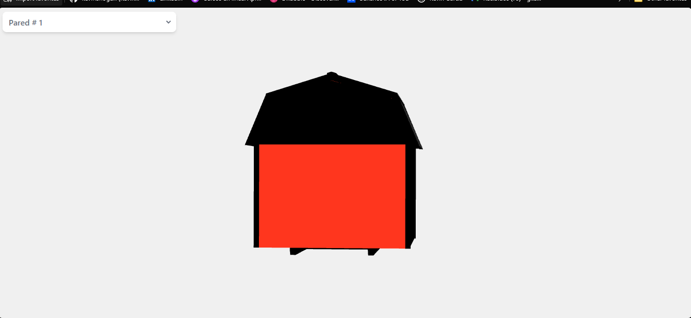

# Aplicación de React con Vite y Tailwind CSS

Este es el repositorio de una aplicación de React que utiliza Vite como bundler y Tailwind CSS como framework de estilos.

El objetivo de esta aplicación es renderizar un modelo 3D de un granero y permitir al usuario seleccionar y resaltar paredes específicas del granero cambiando su color. Además, la aplicación incluye un menú desplegable para que el usuario pueda seleccionar qué pared resaltar.

## Flujo de la aplicación

1. La aplicación inicializa dos variables de estado utilizando el hook useState: `selectedWall` y `rotationWall`.
2. Se utiliza el hook useEffect para actualizar la variable de estado `rotationWall` en función de la variable de estado `selectedWall`.
3. La aplicación retorna un componente Canvas de la librería @react-three/fiber, el cual renderiza el modelo 3D del granero.
4. El componente Model se pasa como hijo del componente Suspense, el cual se utiliza para manejar la carga del modelo 3D.
5. El componente Model recibe varias propiedades, incluyendo la variable de estado `selectedWall` y la función `setSelectedWall`, que se utiliza para actualizar la variable de estado `selectedWall`.
6. La aplicación también retorna un menú desplegable para que el usuario pueda seleccionar qué pared resaltar.

## Instalación

Sigue estos pasos para instalar y ejecutar la aplicación:

1. Clona este repositorio en tu máquina local.
2. Navega hasta el directorio del proyecto.
3. Ejecuta el siguiente comando para instalar las dependencias:

   ```shell
   npm install
   ```

4. Una vez que la instalación se haya completado, ejecuta el siguiente comando para iniciar la aplicación:

   ```shell
   npm run dev
   ```

   La aplicación se ejecutará en modo de desarrollo en `http://localhost:3000`.

## Uso

Después de ejecutar la aplicación, podrás ver el modelo 3D del granero renderizado en la pantalla. Utiliza el menú desplegable para seleccionar la pared que deseas resaltar. Al cambiar la selección, la pared seleccionada cambiará de color para resaltarse.

Si deseas realizar cambios en la aplicación, simplemente edita los archivos fuente en el directorio `src`. La aplicación se recargará automáticamente cuando guardes los cambios.

## Personalización

Si deseas personalizar los estilos o agregar nuevas funcionalidades, puedes editar los archivos correspondientes en el directorio `src`. Puedes utilizar Tailwind CSS para aplicar estilos personalizados.

## Contribución

Si deseas contribuir a este proyecto, siéntete libre de hacerlo. Puedes abrir un problema para reportar errores o sugerir mejoras, o enviar una solicitud de extracción con tus cambios propuestos.

## Foto



## Licencia

Este proyecto está bajo la [Licencia MIT](LICENSE).